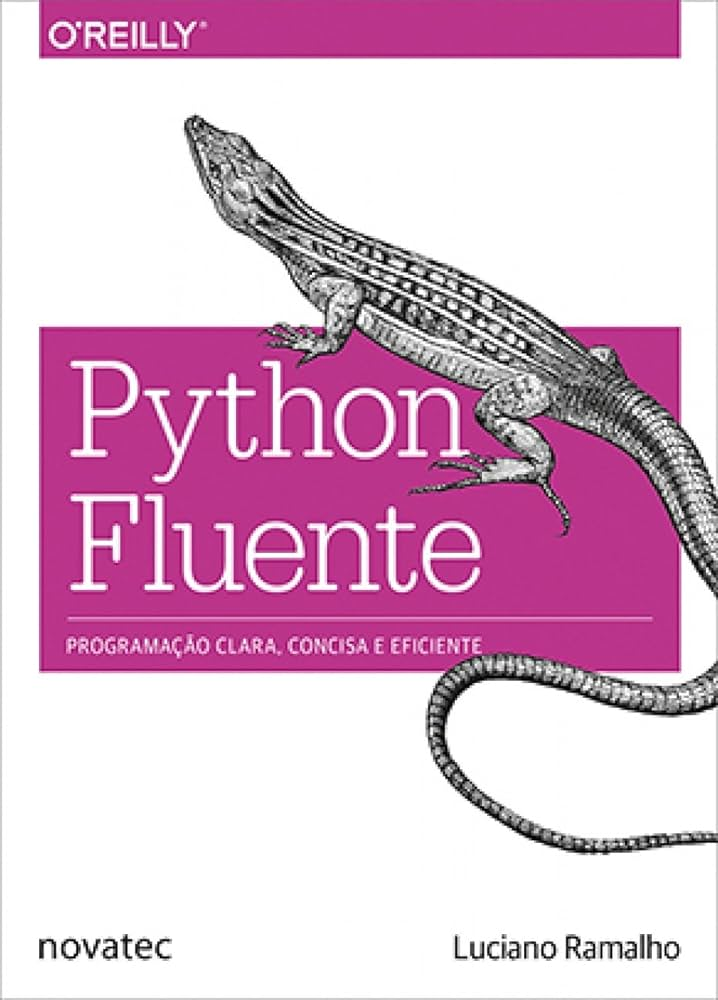

<!-- Capa do livro (fundo transparente) -->

  

<h1 align="center">Grupo de Estudos — Python Fluente (2ª edição)</h1>

  Encontros semanais às <strong>terças, 19h–20h</strong> (America/Sao_Paulo) para estudar o livro capítulo a capítulo.

---

## 📖 Objetivo
Ler e discutir o *Python Fluente* (2ª ed.) em ritmo constante, praticando Python idiomático e boas práticas.

## 🗓️ Encontros
- **Quando:** terças, **19h–20h**  
- **Formato:** online (adicione aqui o link fixo)  
- **Ritmo sugerido:** 1 capítulo/semana  
> Dica de pauta: Abertura (5 min) · Discussão (40–45 min) · Encerramento (10–15 min)

## 🤝 Combinados
- Respeito e colaboração; todas as perguntas são bem-vindas.  
- Leia o capítulo (ou parte) antes do encontro.  
- Traga 1 exemplo/insight do capítulo.  

---

## 🧷 Prefácio — visão geral
O prefácio apresenta a ambição do livro: escrever **Python idiomático**, entendendo o **modelo de dados** da linguagem, usando **coleções**, **funções de primeira classe**, **protocolos/ABCs**, **concorrência** e **metaprogramação** com responsabilidade. O foco é **legibilidade**, **testes** e o uso consciente da biblioteca padrão.  
*Resumo autoral para fins de estudo.*

---

## ✅ Checklist de progresso (2ª edição – 24 capítulos)
Marque com **[x]** conforme avançar.

- [ ] **Prefácio**
- [ ] **Cap. 01 — Modelo de dados do Python**
- [ ] **Cap. 02 — Uma coleção de sequências**
- [ ] **Cap. 03 — Dicionários e conjuntos**
- [ ] **Cap. 04 — Texto Unicode versus bytes**
- [ ] **Cap. 05 — Construtores de *data classes***
- [ ] **Cap. 06 — Referências a objetos, mutabilidade e reciclagem**
- [ ] **Cap. 07 — Funções como objetos de primeira classe**
- [ ] **Cap. 08 — Dicas/anotações de tipo em funções**
- [ ] **Cap. 09 — Decoradores e *closures***
- [ ] **Cap. 10 — Padrões de projeto com funções de primeira classe**
- [ ] **Cap. 11 — Um objeto “pythônico”**
- [ ] **Cap. 12 — Métodos especiais para sequências**
- [ ] **Cap. 13 — Interfaces, protocolos e ABCs**
- [ ] **Cap. 14 — Herança: para o bem ou para o mal**
- [ ] **Cap. 15 — Mais sobre dicas/anotações de tipo**
- [ ] **Cap. 16 — Sobrecarga de operadores**
- [ ] **Cap. 17 — Iteradores, geradores e corrotinas clássicas**
- [ ] **Cap. 18 — *with*, *match* e blocos *else***
- [ ] **Cap. 19 — Modelos de concorrência em Python**
- [ ] **Cap. 20 — *Executors* concorrentes**
- [ ] **Cap. 21 — Programação assíncrona**
- [ ] **Cap. 22 — Atributos dinâmicos e propriedades**
- [ ] **Cap. 23 — Descritores de atributo**
- [ ] **Cap. 24 — Metaprogramação de classes**

> Fonte do sumário (inglês) da 2ª edição, base das traduções acima. :contentReference[oaicite:1]{index=1}  
> A edição PT (Portugal) no site da O’Reilly confirma a divisão em partes (ex.: “Fluxo de Controlo”). :contentReference[oaicite:2]{index=2}

---

## 👤 Sobre o autor
**Luciano Ramalho** — desenvolvedor, instrutor e autor de *Fluent Python* (*Python Fluente*), referência em Python idiomático.

  

---

## ⚖️ Nota de uso
Repositório para **estudo**. Respeite direitos autorais: não publique trechos integrais do livro.
